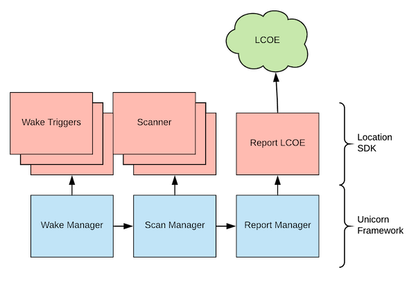

---?image=assets/images/jetpack_unicorn.png&size=cover&opacity=20

### Unicorn Framework

---?color=#f3f3f3

### Signal collection via the Location SDK

---?color=#f3f3f3

### Visualizing RAW signal data

<iframe class="stretch" data-src="https://unicron-nextgen.cloud.mapquest.com/"></iframe>

---?color=#f3f3f3

### Devices of interest

<iframe class="stretch" data-src="https://5eu9km5w3g.execute-api.us-east-1.amazonaws.com/prod/static/plot_geojson.html"></iframe>

---?color=#f3f3f3

### Location fingerprinting

<iframe class="stretch" data-src="https://xumgm8mdzc.execute-api.us-east-1.amazonaws.com/dev/doiDevicesByLocation?longitude=-104.999451&latitude=39.752355&radius=50"></iframe>

---?color=#f3f3f3

### Location Verification

---?color=#f3f3f3

### Indoor location provider

---?color=#f3f3f3

### Location sharing

