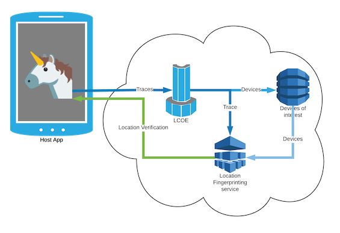
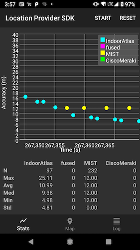

---?image=assets/img/jetpack_unicorn.png&size=cover&opacity=100

@transition[fade-out]

## @color[orange](Unicorn Team)

---?image=assets/img/jetpack_unicorn.png&size=cover&opacity=10

### Signal collection via the Location SDK

---?image=assets/img/jetpack_unicorn.png&size=cover&opacity=10

### Visualizing signal data

<iframe class="stretch" data-src="https://unicron-nextgen.cloud.mapquest.com/"></iframe>

---?image=assets/img/jetpack_unicorn.png&size=cover&opacity=10

### Geo-fences

<iframe class="stretch" data-src="https://hoofprints.cloud.mapquest.com/"></iframe>

---?image=assets/img/jetpack_unicorn.png&size=cover&opacity=10

### Devices of interest

<iframe class="stretch" data-src="https://5eu9km5w3g.execute-api.us-east-1.amazonaws.com/prod/static/plot_geojson.html"></iframe>

---?image=assets/img/jetpack_unicorn.png&size=cover&opacity=10

### Location verification

---?image=assets/img/jetpack_unicorn.png&size=cover&opacity=10

### Indoor location provider

---?image=assets/img/jetpack_unicorn.png&size=cover&opacity=10

### Location sharing

