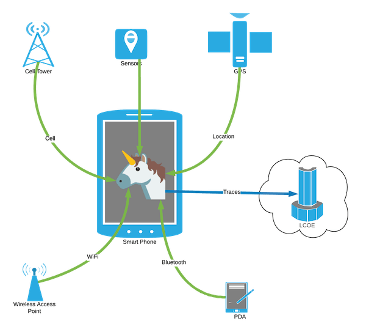
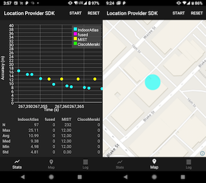
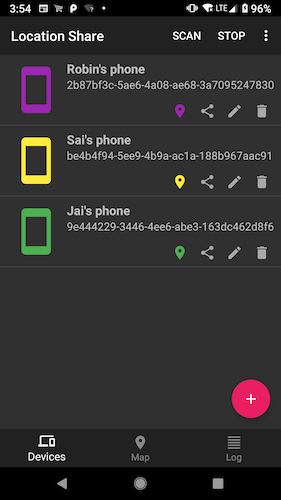

---?image=assets/img/jetpack_unicorn.png&size=cover&opacity=10

### Unicorn Framework

---?image=assets/img/jetpack_unicorn.png&size=cover&opacity=10

### Signal collection via the Location SDK

---?image=assets/img/jetpack_unicorn.png&size=cover&opacity=10

### Visualizing RAW signal data

<iframe class="stretch" data-src="https://unicron-nextgen.cloud.mapquest.com/"></iframe>

---?image=assets/img/jetpack_unicorn.png&size=cover&opacity=10

### Devices of interest

<iframe class="stretch" data-src="https://5eu9km5w3g.execute-api.us-east-1.amazonaws.com/prod/static/plot_geojson.html"></iframe>

---?image=assets/img/jetpack_unicorn.png&size=cover&opacity=10

### Location fingerprinting

<iframe class="stretch" data-src="https://xumgm8mdzc.execute-api.us-east-1.amazonaws.com/dev/doiDevicesByLocation?longitude=-104.999451&latitude=39.752355&radius=50"></iframe>

---?image=assets/img/jetpack_unicorn.png&size=cover&opacity=10

### Location Verification

---?image=assets/img/jetpack_unicorn.png&size=cover&opacity=10

### Indoor location provider

---?image=assets/img/jetpack_unicorn.png&size=cover&opacity=10

### Location sharing

